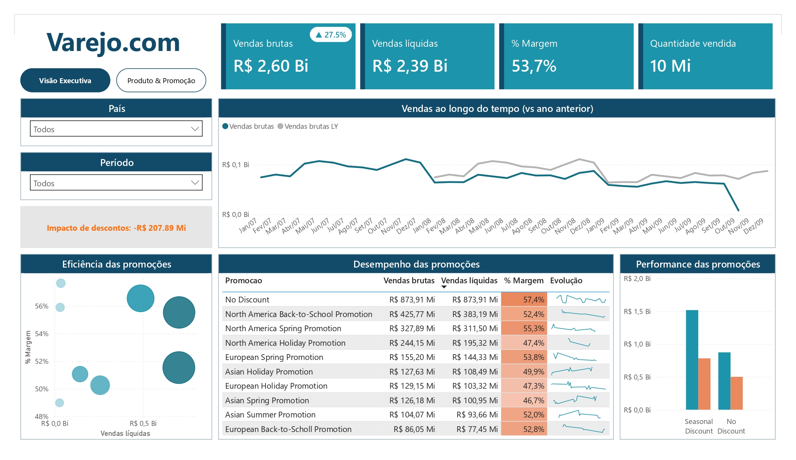
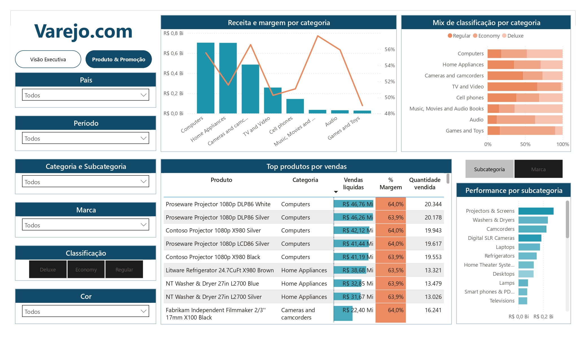

# 📊 Análise Comercial e Eficiência de Promoções

Este repositório apresenta a resolução de um case técnico voltado para o setor de varejo. O objetivo principal do projeto foi avaliar o impacto real das campanhas promocionais nas vendas e na rentabilidade da empresa, identificando quais estratégias trazem retorno financeiro saudável e quais comprometem a margem de lucro.

## 🎯 Desafio de Negócio

Uma grande empresa de varejo com atuação global investe fortemente em promoções, mas enfrentava dificuldades para responder a perguntas estratégicas fundamentais:
* Quais promoções realmente funcionam e geram valor líquido?
* Quais produtos e categorias possuem maior performance de vendas?
* Os descontos aplicados estão canibalizando ou impulsionando positivamente a margem?

Para solucionar essas dores, foi desenvolvido um ecossistema analítico completo que transforma dados brutos dispersos em insights estratégicos para tomada de decisão executiva.

## 🏗️ Engenharia e Modelagem de Dados

O modelo original fornecido apresentava uma estrutura ineficiente (*Snowflake* desnecessário). Para otimizar o desempenho das consultas e facilitar a escrita de cálculos analíticos, foi realizada uma reestruturação completa para o modelo **Star Schema (Estrela)**:

* **Tabela Fato:** `Vendas` (centralizando métricas volumétricas).
* **Tabelas Dimensão:** `Produto`, `Promoção`, `Loja` e `Calendário`.
* **Otimização Semântica:** A dimensão de `Localidades` foi inteligentemente unificada à tabela de `Lojas`. Essa decisão de design preservou a flexibilidade do modelo para futuras expansões (como inclusão de dimensões para Clientes ou Fornecedores) sem sobrecarregar a estrutura repetindo dados em excesso.

## 📐 Inteligência de Negócio & Métricas DAX

Foram desenvolvidas diversas métricas e tabelas calculadas utilizando DAX avançado, divididas em blocos de análise:

1. **Métricas Principais:** Controle rigoroso de Vendas Brutas, Custos Totais, Quantidade Vendida e Vendas Líquidas.
2. **Análise de Descontos:** Mensuração do impacto financeiro real causado pela concessão de descontos e representatividade percentual sobre a receita bruta.
3. **Análise Temporal (Time Intelligence):** Cálculos comparativos contra o ano anterior (`LY - Last Year`) e taxa de crescimento percentual ano a ano (`% crescimento vs LY`).
4. **Eficiência e Rentabilidade:** Métricas cruciais de Margem Absoluta e `% Margem` para identificar a saúde financeira por campanha.
5. **Contexto de Filtro:** Cálculo de participação percentual de receita por categoria específica e participação total no faturamento global (utilizando funções modificadoras de contexto como `ALL`).

## 🔒 Segurança e Governança (RLS Dinâmico)

Para garantir a governança e a segurança da informação em nível corporativo, foi implementada a segurança em nível de linha (**RLS Dinâmico - Row-Level Security**). 
Utilizando a função `USERPRINCIPALNAME()`, o modelo restringe os dados dinamicamente de acordo com o usuário conectado. Dessa forma, gestores e analistas de um determinado país conseguem visualizar estritamente os resultados de sua respectiva localidade, mantendo os dados sensíveis protegidos.

## 🎨 Design do Dashboard e Visualizações

O painel foi construído seguindo as melhores práticas de Storytelling e User Experience (UX), utilizando uma identidade visual corporativa (paleta *Azul Petróleo, Laranja e Cinza* para alto contraste). 

O dashboard divide-se em duas páginas focadas no usuário:
* **Página 1 — Visão Executiva:** Focada no nível macro. Apresenta KPIs principais de faturamento e margem, evolução temporal e um ranking detalhado de eficiência para avaliar a performance de cada promoção.
* **Página 2 — Produto & Promoção:** Focada no nível tático/operacional. Traz a quebra da receita por categoria, mix de classificação dos itens (Economy, Regular, Deluxe) e tabelas dinâmicas ricas enriquecidas com formatação condicional (barras de dados e mini gráficos).

## 💡 Principais Insights Gerados

* **Canibalização de Margem:** Promoções que oferecem descontos agressivos geraram alto volume de vendas, mas reduziram drasticamente a margem líquida média, comprovando que algumas campanhas geram faturamento sacrificando o lucro.
* **Rentabilidade Orgânica:** Produtos comercializados sem desconto apresentaram a maior consistência de rentabilidade percentual para o caixa da empresa.
* **Concentração de Receita:** A receita global da empresa demonstrou forte dependência de um grupo restrito de produtos principais (Curva ABC latente), indicando a necessidade de diversificação ou blindagem comercial desses SKUs líderes.

  

